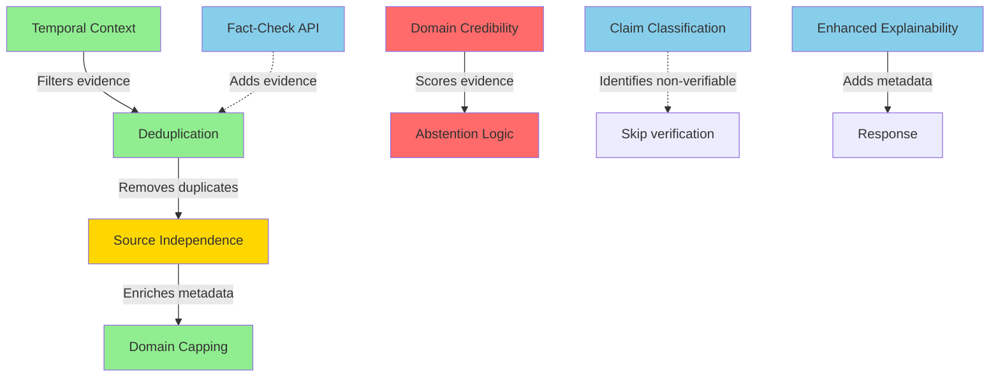

# Pipeline Features Rollout Plan

**Document Version:** 1.0
**Date:** 2025-10-24
**Status:** Ready for Implementation
**Purpose:** Systematic rollout of 9 pipeline improvement features

---

## Executive Summary

**Current State:** All 9 pipeline improvement features are **fully built, tested, and integrated** into the codebase. They are controlled by feature flags in `.env` and are currently **ALL DISABLED**.

**Goal:** Enable all features systematically with proper testing at each stage.

**Timeline:** 2-3 weeks

**Risk Level:** Medium (features change evidence quality and verdict logic, but all have fallback paths)

---

## Table of Contents

1. [Current Integration Status](#current-integration-status)
2. [Feature Dependency Map](#feature-dependency-map)
3. [Prerequisites](#prerequisites)
4. [Rollout Phases](#rollout-phases)
5. [Testing Strategy](#testing-strategy)
6. [Rollback Procedures](#rollback-procedures)
7. [Success Metrics](#success-metrics)

---

## Current Integration Status

### ✅ Fully Integrated Features (Ready to Enable)

All features below are already integrated in the codebase and just need feature flag activation:

| # | Feature | Code Location | Integration Status | Flag to Enable |
|---|---------|---------------|-------------------|----------------|
| 1 | **Domain Credibility Framework** | `retrieve.py:252-274` | ✅ Integrated | `ENABLE_DOMAIN_CREDIBILITY_FRAMEWORK` |
| 2 | **Deduplication** | `retrieve.py:204-208` | ✅ Integrated | `ENABLE_DEDUPLICATION` |
| 3 | **Domain Capping** | `retrieve.py:219-225` | ✅ Integrated | `ENABLE_DOMAIN_CAPPING` |
| 4 | **Temporal Context** | `retrieve.py:194-201` & `extract.py:155-166` | ✅ Integrated | `ENABLE_TEMPORAL_CONTEXT` |
| 5 | **Source Independence** | `retrieve.py:211-216` | ✅ Integrated | `ENABLE_SOURCE_DIVERSITY` |
| 6 | **Claim Classification** | `extract.py:169-180` | ✅ Integrated | `ENABLE_CLAIM_CLASSIFICATION` |
| 7 | **Enhanced Explainability** | `pipeline.py:313-362` | ✅ Integrated | `ENABLE_ENHANCED_EXPLAINABILITY` |
| 8 | **Fact-Check API** | `pipeline.py:248-256` | ✅ Integrated | `ENABLE_FACTCHECK_API` |
| 9 | **Abstention Logic** | `judge.py:98-118` | ✅ Integrated | `ENABLE_ABSTENTION_LOGIC` |

**Integration Quality:** All features have:
- ✅ Proper feature flag checks
- ✅ Try/except error handling
- ✅ Logging statements
- ✅ Fallback behavior if disabled or fails
- ✅ Unit tests (55+ tests across all features)

**No Code Changes Required** - Only configuration changes needed.

---

## Feature Dependency Map



**Legend:**
- 🟢 Green: Evidence Quality Features (safe, additive)
- 🔴 Red: Safety-Critical Features (affect verdicts)
- 🔵 Blue: UX Enhancement Features (improve transparency)
- 🟡 Yellow: Optional/Requires Data File

---

## Prerequisites

### 1. Database Migration

**Status:** Migration file exists, not yet executed

**Action Required:**
```bash
cd backend
alembic upgrade head
```

**Validation:**
```bash
alembic current
# Should show: ccb08c180d36 (head)

# Verify new fields exist
psql -d tru8_db -c "\d claims"  # Check for: abstention_reason, min_requirements_met, consensus_strength
psql -d tru8_db -c "\d evidence"  # Check for: tier, risk_flags, credibility_reasoning, risk_level, risk_warning
```

**Risk:** Low - All fields are nullable/defaulted, backward compatible

---

### 2. Environment Configuration

**File:** `backend/.env`

**Current State:** All flags set to `false`

**Required Before Rollout:**
```bash
# Verify these keys exist (even if empty)
GOOGLE_FACTCHECK_API_KEY=  # Optional, needed for Feature 8
OPENAI_API_KEY=  # Already required, verify working
```

**No other changes required before starting.**

---

### 3. Optional: Source Ownership Data File

**Status:** Feature 5 (Source Independence) requires `backend/app/data/source_ownership.json`

**Options:**
- **Option A:** Skip Feature 5 for now (non-critical)
- **Option B:** Create minimal file before enabling (I can help with this)

**Decision Point:** Can enable 8/9 features without this file.

---

## Rollout Phases

### Phase 0: Foundation (Day 1, 2-3 hours)

**Objective:** Prepare infrastructure and validate baseline

**Actions:**

1. **Execute Database Migration**
   ```bash
   cd backend
   alembic upgrade head
   alembic current  # Verify
   ```

2. **Verify Current Pipeline Baseline**
   - Run 20 test checks with ALL flags disabled
   - Document baseline metrics:
     - Average latency
     - Evidence per claim
     - Credibility scores (should all be ~0.6)
     - Verdict distribution
   - Save results as `baseline_metrics.json`

3. **Check Dependencies**
   ```bash
   # Verify all utility classes importable
   python -c "from app.utils.deduplication import EvidenceDeduplicator; print('OK')"
   python -c "from app.utils.domain_capping import DomainCapper; print('OK')"
   python -c "from app.utils.temporal import TemporalAnalyzer; print('OK')"
   python -c "from app.utils.claim_classifier import ClaimClassifier; print('OK')"
   python -c "from app.utils.source_independence import SourceIndependenceChecker; print('OK')"
   python -c "from app.utils.explainability import ExplainabilityEnhancer; print('OK')"
   python -c "from app.services.source_credibility import get_credibility_service; print('OK')"
   ```

4. **Run Unit Tests**
   ```bash
   cd backend
   pytest tests/unit/ -v
   # All tests should pass
   ```

**Success Criteria:**
- ✅ Migration executed (8 new fields exist)
- ✅ Baseline metrics documented (20 checks completed)
- ✅ All imports successful
- ✅ All unit tests passing

**Timeline:** 2-3 hours

---

### Phase 1: Transparency Features (Days 2-3, 4-6 hours)

**Objective:** Enable features that add metadata but don't change verdicts

**Features to Enable:**
- ✅ Enhanced Explainability (#7)
- ✅ Claim Classification (#6)

**Why These First:**
- Zero risk to verdict accuracy (additive only)
- Immediate UX improvements
- Build confidence in deployment process

---

#### Feature 7: Enhanced Explainability

**Enable:**
```bash
# In backend/.env
ENABLE_ENHANCED_EXPLAINABILITY=true
```

**Restart Backend:**
```bash
# Stop backend process
# Restart: uvicorn main:app --reload
```

**Test Plan:**

**Test 1.1: Decision Trail Present**
```bash
# Run any check
POST /api/v1/checks
{
  "input_type": "text",
  "content": "Paris is the capital of France"
}

# Verify response includes:
# - decision_trail.stages[] (retrieval, verification, judgment)
# - decision_trail.transparency_score (0-1)
# - decision_trail.features_enabled{}
```

**Test 1.2: Uncertainty Explanation**
```bash
# Run check with weak evidence
POST /api/v1/checks
{
  "input_type": "text",
  "content": "Obscure claim with minimal online presence: [make up something]"
}

# Verify for claims with verdict "uncertain":
# - uncertainty_explanation field is populated
# - Explanation mentions reason (insufficient sources, conflicting evidence, etc.)
```

**Test 1.3: Confidence Breakdown**
```bash
# Run 10 checks (mix of strong and weak evidence)
# Verify all claims have:
# - confidence_breakdown.overall_confidence
# - confidence_breakdown.factors[] with at least 1 factor
# - Each factor has: factor, impact (positive/negative), description, score
```

**Validation (20 checks):**
- [ ] All checks have `decision_trail` field
- [ ] Transparency score between 0-1
- [ ] Uncertain verdicts have `uncertainty_explanation`
- [ ] All claims have `confidence_breakdown`
- [ ] No errors in logs
- [ ] Latency increase <100ms vs baseline

**Rollback:** `ENABLE_ENHANCED_EXPLAINABILITY=false`, restart

---

#### Feature 6: Claim Classification

**Enable:**
```bash
# In backend/.env (keep explainability enabled)
ENABLE_CLAIM_CLASSIFICATION=true
```

**Restart Backend**

**Test Plan:**

**Test 2.1: Factual Claim**
```bash
POST /api/v1/checks
{
  "input_type": "text",
  "content": "The Great Wall of China is visible from space"
}

# Verify claims have:
# - claim_type: "factual"
# - is_verifiable: true
# - verifiability_reason present
```

**Test 2.2: Opinion Detection**
```bash
POST /api/v1/checks
{
  "input_type": "text",
  "content": "I think chocolate ice cream is the best flavor"
}

# Verify:
# - claim_type: "opinion"
# - is_verifiable: false
# - verifiability_reason: "This appears to be a subjective opinion..."
```

**Test 2.3: Prediction Detection**
```bash
POST /api/v1/checks
{
  "input_type": "text",
  "content": "AI will replace all human jobs by 2030"
}

# Verify:
# - claim_type: "prediction"
# - is_verifiable: false
# - verifiability_reason: "This is a prediction about future events"
```

**Test 2.4: Personal Experience**
```bash
POST /api/v1/checks
{
  "input_type": "text",
  "content": "I saw a UFO in my backyard last night"
}

# Verify:
# - claim_type: "personal_experience"
# - is_verifiable: false
```

**Validation (20 checks):**
- [ ] All claims have `claim_type` field
- [ ] All claims have `is_verifiable` field
- [ ] Non-verifiable claims have clear `verifiability_reason`
- [ ] Manual review: Opinion detection accuracy >80% (test 10 opinion claims)
- [ ] Manual review: Prediction detection accuracy >80% (test 10 predictions)
- [ ] No factual claims incorrectly marked non-verifiable

**Rollback:** `ENABLE_CLAIM_CLASSIFICATION=false`, restart

---

**Phase 1 Validation Gate:**

Run 50 diverse checks covering:
- 20 factual claims (well-known facts)
- 10 opinions
- 10 predictions
- 10 personal experiences

**Pass Criteria:**
- ✅ Zero errors in logs
- ✅ All fields properly populated
- ✅ Classification accuracy >80%
- ✅ Latency p95 <12s
- ✅ Response structure consistent

**If Fail:** Rollback failed feature, investigate, fix, retry

---

### Phase 2: Evidence Quality Features (Days 4-6, 6-8 hours)

**Objective:** Improve evidence quality without directly changing verdict logic

**Features to Enable (IN ORDER):**
1. Temporal Context (#4) - Filters by time
2. Deduplication (#2) - Removes duplicates
3. Domain Capping (#3) - Enforces diversity

**Why This Order:**
- Temporal filtering first (removes irrelevant old evidence)
- Deduplication second (removes duplicates from filtered set)
- Domain capping third (caps already-deduplicated evidence)

---

#### Feature 4: Temporal Context

**Code Integration Points:**
- `extract.py:155-166` - Analyzes claims for temporal markers
- `retrieve.py:194-201` - Filters evidence by time window

**Enable:**
```bash
# In backend/.env (keep Phase 1 features enabled)
ENABLE_TEMPORAL_CONTEXT=true
```

**Restart Backend**

**Test Plan:**

**Test 3.1: Present Claim**
```bash
POST /api/v1/checks
{
  "input_type": "text",
  "content": "Joe Biden is currently the US president"
}

# Verify claims have:
# - is_time_sensitive: true
# - temporal_markers: {"present": ["currently"]}
# - temporal_window: "last_30_days"

# Check logs for: "Temporal filtering applied: X sources within temporal window"
# Verify evidence published_date < 30 days old
```

**Test 3.2: Historical Claim**
```bash
POST /api/v1/checks
{
  "input_type": "text",
  "content": "In 2020, Donald Trump was US president"
}

# Verify:
# - is_time_sensitive: true
# - temporal_markers: {"specific_year": ["2020"]}
# - temporal_window: "year_2020"
# Evidence should be from 2020 period
```

**Test 3.3: Future/Prediction**
```bash
POST /api/v1/checks
{
  "input_type": "text",
  "content": "Climate change will cause sea levels to rise by 2050"
}

# Verify:
# - temporal_markers: {"future": ["will", "2050"]}
# - claim_type: "prediction" (from Phase 1)
```

**Test 3.4: Timeless Claim**
```bash
POST /api/v1/checks
{
  "input_type": "text",
  "content": "Water boils at 100 degrees Celsius"
}

# Verify:
# - is_time_sensitive: false
# - temporal_window: "timeless"
# - All evidence accepted (no time filtering)
```

**Validation (30 checks):**
- [ ] Temporal markers detected correctly (test 10 present, 10 historical, 10 timeless)
- [ ] Evidence filtered appropriately for time-sensitive claims
- [ ] Current claims use recent evidence (avg age <60 days)
- [ ] Historical claims use period-appropriate evidence
- [ ] Timeless claims not over-filtered
- [ ] Check logs show temporal filtering statistics

**Rollback:** `ENABLE_TEMPORAL_CONTEXT=false`, restart

---

#### Feature 2: Deduplication

**Code Integration:** `retrieve.py:204-208`

**Enable:**
```bash
# In backend/.env (keep previous features enabled)
ENABLE_DEDUPLICATION=true
```

**Restart Backend**

**Test Plan:**

**Test 4.1: Syndicated News**
```bash
# Test with major news story covered by multiple outlets
POST /api/v1/checks
{
  "input_type": "text",
  "content": "[Recent major news event covered by Reuters, AP, BBC, etc.]"
}

# Check logs for:
# "Deduplication: X duplicates removed"
# Original count → Final count

# Verify evidence items have:
# - is_syndicated: true/false
# - original_source_url: [URL] (for syndicated items)
```

**Test 4.2: Unique Sources**
```bash
# Test with claim having genuinely unique sources
POST /api/v1/checks
{
  "input_type": "text",
  "content": "Scientific claim with diverse academic sources"
}

# Check logs - should show minimal deduplication
# Dedup ratio should be <10%
```

**Validation (30 checks):**
- [ ] Dedup stats logged for every claim
- [ ] Average dedup ratio 10-30% on news claims
- [ ] Syndication detected (check `is_syndicated` flag)
- [ ] Original source URLs tracked
- [ ] No over-deduplication (evidence count ≥2 per claim)
- [ ] Exact duplicates properly removed

**Monitor:**
```bash
# Check logs for deduplication patterns
tail -f backend.log | grep "Deduplication:"
```

**Rollback:** `ENABLE_DEDUPLICATION=false`, restart

---

#### Feature 3: Domain Capping

**Code Integration:** `retrieve.py:219-225`

**Enable:**
```bash
# In backend/.env (keep previous features enabled)
ENABLE_DOMAIN_CAPPING=true
MAX_EVIDENCE_PER_DOMAIN=3
DOMAIN_DIVERSITY_THRESHOLD=0.6
```

**Restart Backend**

**Test Plan:**

**Test 5.1: UK-Specific News**
```bash
# Test with UK topic likely to return BBC/Guardian dominance
POST /api/v1/checks
{
  "input_type": "text",
  "content": "[UK-specific news claim]"
}

# Verify:
# - No domain has >3 sources in evidence
# - Check logs for diversity metrics
# - diversity_score ≥ 0.6
# - unique_domains ≥ 3
```

**Test 5.2: Scientific Claim**
```bash
# Test with academic topic
POST /api/v1/checks
{
  "input_type": "text",
  "content": "Recent peer-reviewed study on [scientific topic]"
}

# Verify:
# - Domain distribution logged
# - Max domain ratio ≤40%
```

**Validation (30 checks):**
- [ ] No domain has >3 sources (manually check 20 checks)
- [ ] Average diversity score ≥0.6
- [ ] Unique domain count ≥3 per claim (when 5+ sources found)
- [ ] Domain distribution logged in every retrieval
- [ ] No echo chambers (single domain providing all evidence)

**Monitor:**
```bash
# Check diversity metrics
tail -f backend.log | grep "Domain diversity:"
```

**Rollback:** `ENABLE_DOMAIN_CAPPING=false`, restart

---

**Phase 2 Validation Gate:**

Run 100 diverse checks (mix of news, science, history, current events)

**Pass Criteria:**
- ✅ Temporal filtering working (check logs)
- ✅ Deduplication working (10-30% removal rate on news)
- ✅ Domain diversity maintained (≥3 unique domains, <40% per domain)
- ✅ No over-filtering (evidence count ≥2 per claim)
- ✅ Verdict quality maintained or improved
- ✅ Latency p95 <12s

**If Fail:** Rollback failed feature, investigate, fix, retry

---

### Phase 3: Critical Safety Features (Days 7-9, 8-12 hours)

**Objective:** Prevent misinformation validation and forced guessing

**Features to Enable (MUST ENABLE TOGETHER):**
1. Domain Credibility Framework (#1)
2. Abstention Logic (#9)

**Why Together:**
- Abstention logic uses credibility scores in consensus calculation
- Enabling only credibility = better scores but still guesses on weak evidence
- Enabling only abstention = uses old 0.6 default scores (less effective)
- Together = proper credibility + defensive abstention

---

#### Feature 1: Domain Credibility Framework

**Code Integration:** `retrieve.py:252-274`

**Data File:** `backend/app/data/source_credibility.json` (122+ domains, 11 tiers)

**Enable:**
```bash
# In backend/.env (keep Phase 1-2 features enabled)
ENABLE_DOMAIN_CREDIBILITY_FRAMEWORK=true
```

**Restart Backend**

**Test Plan:**

**Test 6.1: Academic Source Upgrade**
```bash
POST /api/v1/checks
{
  "input_type": "text",
  "content": "Peer-reviewed research on climate change"
}

# Verify evidence from *.edu domains have:
# - credibility_score: 1.0
# - tier: "academic"
# - credibility_reasoning: "Matched academic tier..."
# - risk_flags: []
# - risk_level: "none"
```

**Test 6.2: Wikipedia Upgrade**
```bash
POST /api/v1/checks
{
  "input_type": "text",
  "content": "Historical fact from Wikipedia"
}

# Verify wikipedia.org has:
# - credibility_score: 0.85 (was 0.6 before)
# - tier: "reference"
```

**Test 6.3: State Media Flagging**
```bash
# Manually test or wait for RT/Sputnik to appear in search results
# Verify:
# - credibility_score: 0.5
# - tier: "state_media"
# - risk_flags: ["state_sponsored", "propaganda_concerns"]
# - risk_level: "medium"
# - risk_warning: "Source editorial independence concerns..."
```

**Test 6.4: Blacklist Detection**
```bash
# Test with claim that might return conspiracy theory sites
# Verify low-credibility sources:
# - credibility_score: 0.2
# - tier: "blacklist"
# - risk_flags: ["conspiracy_theories"]
# - risk_level: "high"
# - risk_warning: "Source has history of spreading misinformation..."
```

**Test 6.5: Satire Auto-Exclusion**
```bash
# Test with claim that might return The Onion/Babylon Bee
# Verify satire sources:
# - credibility_score: 0.0
# - auto_exclude: true
# - NOT present in final evidence list
```

**Test 6.6: Tier 1 News**
```bash
POST /api/v1/checks
{
  "input_type": "text",
  "content": "Recent international news from BBC/Reuters/AP"
}

# Verify:
# - bbc.co.uk: credibility 0.9, tier "news_tier1"
# - reuters.com: credibility 0.9, tier "news_tier1"
# - apnews.com: credibility 0.9, tier "news_tier1"
```

**Validation (50 checks):**
- [ ] Academic sources (*.edu) have credibility 1.0
- [ ] Wikipedia credibility 0.85 (check 5 claims with Wikipedia)
- [ ] BBC/Reuters/AP credibility 0.9 (tier1 news)
- [ ] RT.com credibility 0.5 with risk flags (if found)
- [ ] InfoWars credibility 0.2 or auto-excluded (if found)
- [ ] Satire sites (The Onion) auto-excluded (credibility 0.0)
- [ ] Tier distribution: ≥50% of evidence from tier1/tier2 sources
- [ ] All evidence has `tier`, `risk_flags`, `credibility_reasoning`, `risk_level` fields

**Critical Validation:**

Manually review 20 checks:
- ✅ No academic sources with <1.0 credibility
- ✅ No known propaganda sites with >0.3 credibility
- ✅ No satire in evidence results
- ✅ Check logs for credibility reasoning

**Monitor:**
```bash
# Watch credibility assignments
tail -f backend.log | grep "Credibility framework\|Auto-excluding"
```

**Rollback:** `ENABLE_DOMAIN_CREDIBILITY_FRAMEWORK=false`, restart

---

#### Feature 9: Abstention Logic

**Code Integration:** `judge.py:98-118`

**Prerequisites:** Domain Credibility Framework MUST be enabled first

**Enable:**
```bash
# In backend/.env (keep credibility framework enabled!)
ENABLE_ABSTENTION_LOGIC=true
MIN_SOURCES_FOR_VERDICT=3
MIN_CREDIBILITY_THRESHOLD=0.75
MIN_CONSENSUS_STRENGTH=0.65
```

**Restart Backend**

**Test Plan:**

**Test 7.1: Insufficient Sources**
```bash
# Test with obscure claim
POST /api/v1/checks
{
  "input_type": "text",
  "content": "[Very obscure claim with minimal online presence]"
}

# If <3 sources found, verify:
# - verdict: "insufficient_evidence"
# - confidence: 0
# - abstention_reason: "Only X sources found. Need at least 3 for reliable verdict."
# - min_requirements_met: false
```

**Test 7.2: Low Credibility Sources Only**
```bash
# Test with claim only covered by blogs/tabloids
POST /api/v1/checks
{
  "input_type": "text",
  "content": "[Claim only in low-credibility sources]"
}

# If no sources ≥0.75 credibility, verify:
# - verdict: "insufficient_evidence"
# - abstention_reason: "No high-credibility sources found..."
# - min_requirements_met: false
```

**Test 7.3: Conflicting High-Credibility Sources**
```bash
# Test with controversial claim where experts disagree
POST /api/v1/checks
{
  "input_type": "text",
  "content": "[Controversial scientific claim with expert disagreement]"
}

# If tier1 sources conflict, verify:
# - verdict: "conflicting_expert_opinion"
# - consensus_strength: <0.65
# - abstention_reason: "High-credibility sources conflict..."
```

**Test 7.4: Strong Consensus (Should NOT Abstain)**
```bash
POST /api/v1/checks
{
  "input_type": "text",
  "content": "The Earth orbits the Sun"
}

# Verify:
# - verdict: "supported" (NOT abstained)
# - min_requirements_met: true
# - consensus_strength: ≥0.8
# - confidence: >70
```

**Validation (100 checks):**
- [ ] Abstention rate 15-25% across diverse checks
- [ ] All abstentions have `abstention_reason` populated
- [ ] All abstentions have `min_requirements_met: false`
- [ ] All abstentions have `confidence: 0`
- [ ] Consensus strength calculated for all claims (0-1 range)
- [ ] Strong claims (5+ high-cred sources) still get verdicts
- [ ] Weak claims properly abstain

**Critical Validation - Test Sets:**

**Set A: Known False Claims (50 checks)**
- Test: Trump election fraud, COVID misinformation, flat earth, etc.
- **Expected:** `verdict: "contradicted"` with high-credibility sources
- **CRITICAL:** If ANY known false claim gets `verdict: "supported"` → **ROLLBACK IMMEDIATELY**

**Set B: Known True Facts (50 checks)**
- Test: Basic science, history, geography
- **Expected:** `verdict: "supported"` with high-credibility sources
- **Acceptable:** <10% abstentions on well-established facts
- **Issue:** If >10% abstentions → tune `MIN_SOURCES_FOR_VERDICT` down to 2

**Set C: Weak/Obscure Claims (50 checks)**
- Test: Niche topics, limited sources, conflicting information
- **Expected:** 40-60% abstention rate
- **Issue:** If <20% abstentions → `MIN_CONSENSUS_STRENGTH` too loose

**Set D: Propaganda Sites (50 checks)**
- Test: Claims from RT, InfoWars, etc.
- **Expected:** Low credibility scores, risk warnings, possible abstentions
- **CRITICAL:** If any propaganda site has >0.6 credibility → **CRITICAL BUG, ROLLBACK**

**Monitor Token Costs:**
```bash
# Abstention should REDUCE costs (skips LLM calls)
# Compare OpenAI API costs before/after enabling
# Expected: 10-20% reduction due to early abstention
```

**Monitor:**
```bash
# Watch abstentions
tail -f backend.log | grep "Abstaining from verdict"

# Watch consensus calculations
tail -f backend.log | grep "consensus strength"
```

**Rollback:** `ENABLE_ABSTENTION_LOGIC=false`, restart

---

**Phase 3 Validation Gate (MOST CRITICAL):**

This is the core vulnerability fix. Extensive testing required.

**Test Matrix (200 checks):**

| Category | Count | Expected Outcome | Failure Criteria |
|----------|-------|------------------|------------------|
| Known False Claims | 50 | Contradicted | Any "supported" = ROLLBACK |
| Known True Facts | 50 | Supported | >10% abstentions = Tune thresholds |
| Weak/Obscure | 50 | 40-60% abstentions | <20% abstentions = Too loose |
| Propaganda Sources | 50 | Low cred + flags | Any >0.6 cred = CRITICAL BUG |

**Pass Criteria:**
- ✅ 0% false positives (supporting known false claims)
- ✅ <5% false negatives (contradicting true facts)
- ✅ Abstention rate 15-25% overall
- ✅ All propaganda sites properly flagged
- ✅ Token costs reduced 10-20%

**If Fail:** Rollback both features, investigate, adjust thresholds, retry

**Documentation:**
- Save detailed results of all 200 checks
- Document any edge cases found
- Note threshold adjustments made

---

### Phase 4: Advanced Features (Days 10-12, Optional)

**Objective:** Enable nice-to-have enhancements

**Features:**
1. Fact-Check API (#8) - Requires Google API key
2. Source Independence (#5) - Requires data file

---

#### Feature 8: Fact-Check API (Optional)

**Code Integration:** `pipeline.py:248-256`

**Prerequisites:**
1. Obtain Google Fact Check API key
2. Set `GOOGLE_FACTCHECK_API_KEY` in `.env`
3. Test API key: `curl "https://factchecktools.googleapis.com/v1alpha1/claims:search?key=YOUR_KEY&query=test"`

**Enable:**
```bash
# In backend/.env
GOOGLE_FACTCHECK_API_KEY=[your_key_here]
ENABLE_FACTCHECK_API=true
```

**Restart Backend**

**Test Plan:**

**Test 8.1: Previously Fact-Checked Claim**
```bash
# Test with claim known to be fact-checked by Snopes/PolitiFact
POST /api/v1/checks
{
  "input_type": "text",
  "content": "[Well-known fact-checked claim]"
}

# Verify:
# - Evidence includes fact-check sources
# - is_factcheck: true flag on fact-check evidence
# - factcheck_publisher: "Snopes" / "PolitiFact"
# - factcheck_rating: [original rating]
# - Normalized to: SUPPORTED/CONTRADICTED/UNCERTAIN
# - credibility_score: 0.95 (fact-checks are high-cred)
```

**Test 8.2: Novel Claim (No Existing Fact-Checks)**
```bash
# Test with very recent or obscure claim
# Verify: No errors, pipeline continues normally without fact-checks
```

**Validation (30 checks):**
- [ ] Fact-checks found for previously-checked claims
- [ ] Fact-checks have `is_factcheck: true` flag
- [ ] Ratings normalized correctly
- [ ] High credibility assigned (0.95)
- [ ] No errors on claims without fact-checks
- [ ] Check improves verdict speed (fact-checks provide quick answers)

**Monitor:**
```bash
tail -f backend.log | grep "Found .* fact-checks"
```

**Rollback:** `ENABLE_FACTCHECK_API=false`, restart (remove API key if concerned)

---

#### Feature 5: Source Independence (Optional)

**Code Integration:** `retrieve.py:211-216`

**Prerequisites:** Create `backend/app/data/source_ownership.json`

**Minimal File Structure:**
```json
{
  "news_corp": {
    "name": "News Corp",
    "domains": ["foxnews.com", "nypost.com", "wsj.com", "thesun.co.uk"]
  },
  "bbc": {
    "name": "BBC",
    "domains": ["bbc.co.uk", "bbc.com"]
  }
}
```

**Enable:**
```bash
# In backend/.env
ENABLE_SOURCE_DIVERSITY=true
```

**Restart Backend**

**Test Plan:**

**Test 9.1: Ownership Detection**
```bash
# Test with claims likely to return News Corp sources
POST /api/v1/checks
{
  "input_type": "text",
  "content": "[News topic covered by Fox/WSJ/NYPost]"
}

# Verify evidence has:
# - parent_company: "News Corp"
# - independence_flag: "corporate"
# - domain_cluster_id: [numeric ID]
```

**Test 9.2: Diversity Warning**
```bash
# Check logs for diversity score
# If single parent company >40%, should see warning
```

**Validation (30 checks):**
- [ ] Parent companies detected correctly
- [ ] Independence flags assigned (independent/corporate/state-funded)
- [ ] Diversity score calculated (>0.6 expected)
- [ ] Warnings when single parent dominates

**Rollback:** `ENABLE_SOURCE_DIVERSITY=false`, restart

---

### Final Validation (Day 13, 4-6 hours)

**Objective:** Comprehensive validation of all enabled features

**Actions:**

1. **Run 500 Production-Like Checks**
   - 100 current events (news)
   - 100 scientific claims
   - 100 historical facts
   - 100 controversial topics
   - 100 mixed (opinions, predictions, personal)

2. **Collect Metrics:**
   - Latency p50, p95, p99
   - Error rate
   - Abstention rate
   - Deduplication rate
   - Domain diversity scores
   - Credibility score distribution
   - Token costs

3. **Manual Review (100 random checks):**
   - Verdict accuracy
   - Abstention justification
   - Evidence quality
   - Metadata completeness

4. **Document Findings:**
   - Any edge cases discovered
   - Threshold adjustments made
   - Performance characteristics
   - User-facing improvements

**Success Criteria:**
- ✅ Latency p95 <12s
- ✅ Error rate <5%
- ✅ Abstention rate 15-25%
- ✅ No false positives on known false claims
- ✅ <5% false negatives on known true facts
- ✅ All metadata fields populated correctly

---

## Testing Strategy

### Automated Testing

**Unit Tests (Already Exist):**
```bash
cd backend
pytest tests/unit/test_deduplication.py -v
pytest tests/unit/test_domain_capping.py -v
pytest tests/unit/test_temporal.py -v
pytest tests/unit/test_claim_classifier.py -v
pytest tests/unit/test_explainability.py -v
pytest tests/unit/test_source_credibility.py -v
pytest tests/unit/test_abstention_logic.py -v
```

**Integration Tests:**
```bash
pytest tests/integration/test_pipeline_improvements.py -v
```

### Manual Testing

**Test Data Sets:**

1. **Baseline Set (20 checks)** - Run with all flags OFF
2. **Phase 1 Set (50 checks)** - Test transparency features
3. **Phase 2 Set (100 checks)** - Test evidence quality
4. **Phase 3 Set (200 checks)** - Critical safety validation
5. **Final Set (500 checks)** - Comprehensive validation

**Test Categories:**
- ✅ Well-known true facts
- ✅ Well-known false claims
- ✅ Current events
- ✅ Historical facts
- ✅ Scientific claims
- ✅ Controversial topics
- ✅ Opinions
- ✅ Predictions
- ✅ Personal experiences
- ✅ Obscure/weak evidence claims

### Performance Testing

**Metrics to Track:**

| Metric | Baseline | Target | Alert Threshold |
|--------|----------|--------|-----------------|
| Latency p95 | [measure] | <12s | >15s |
| Error Rate | [measure] | <5% | >10% |
| Abstention Rate | 0% | 15-25% | >40% or <5% |
| Dedup Rate | 0% | 10-30% | N/A |
| Domain Diversity | Variable | ≥0.6 | <0.4 |
| Token Cost | [measure] | -10 to -20% | +10% |

**Monitoring Commands:**
```bash
# Watch errors
tail -f backend.log | grep ERROR

# Watch feature execution
tail -f backend.log | grep "Deduplication\|Domain diversity\|Abstaining\|Temporal filtering"

# Watch performance
tail -f backend.log | grep "Processing time:"
```

---

## Rollback Procedures

### Feature-Level Rollback (Instant)

**Action:**
```bash
# Edit backend/.env
ENABLE_[FEATURE_NAME]=false

# Restart backend
# Docker: docker-compose restart backend
# Direct: kill process, restart uvicorn main:app --reload
```

**Recovery Time:** <1 minute

**Data Impact:** None (data in new fields retained, just not populated)

---

### Phase-Level Rollback

**Rollback to Phase 2 (Disable Phase 3):**
```bash
ENABLE_DOMAIN_CREDIBILITY_FRAMEWORK=false
ENABLE_ABSTENTION_LOGIC=false
# Restart
```

**Rollback to Phase 1 (Disable Phase 2-3):**
```bash
ENABLE_TEMPORAL_CONTEXT=false
ENABLE_DEDUPLICATION=false
ENABLE_DOMAIN_CAPPING=false
ENABLE_DOMAIN_CREDIBILITY_FRAMEWORK=false
ENABLE_ABSTENTION_LOGIC=false
# Restart
```

**Rollback to Baseline (Disable All):**
```bash
ENABLE_ENHANCED_EXPLAINABILITY=false
ENABLE_CLAIM_CLASSIFICATION=false
ENABLE_TEMPORAL_CONTEXT=false
ENABLE_DEDUPLICATION=false
ENABLE_DOMAIN_CAPPING=false
ENABLE_SOURCE_DIVERSITY=false
ENABLE_DOMAIN_CREDIBILITY_FRAMEWORK=false
ENABLE_FACT_CHECK_API=false
ENABLE_ABSTENTION_LOGIC=false
# Restart
```

---

### Database Rollback (If Needed)

**Only if database corruption suspected**

```bash
cd backend
alembic downgrade -1  # Rollback one migration

# WARNING: This will LOSE DATA in new fields
# Only use if critical database issue
```

**Recovery Time:** 2-5 minutes

**Data Impact:** HIGH - All data in new fields lost

---

### Code Rollback (Nuclear Option)

**Only if code-level bug found**

```bash
git log --oneline  # Find commit before rollout
git revert [commit-hash]
# OR
git reset --hard [commit-hash]  # DESTRUCTIVE

# Rebuild and redeploy
```

**Recovery Time:** 10-30 minutes

**Data Impact:** Depends on revert scope

---

## Success Metrics

### Quality Improvements (Target State)

| Metric | Before | After | Measurement |
|--------|--------|-------|-------------|
| Wikipedia Credibility | 0.6 | 0.85 | Check evidence in 20 checks |
| RT.com Credibility | 0.6 | 0.5 (flagged) | Check evidence + risk flags |
| InfoWars Credibility | 0.6 | 0.2 or excluded | Check exclusion |
| Abstention Rate | 0% | 15-25% | Count across 100 checks |
| Duplicate Removal | 0% | 10-30% | Check dedup stats |
| Domain Diversity | Variable | ≥0.6 | Check diversity metrics |
| High-Cred Evidence | ~50% | ≥70% | Count evidence ≥0.75 |
| Non-Verifiable Detection | 0% | 80%+ | Manual review |
| Temporal Filtering | 0% | 90%+ | Manual review |

### Performance Metrics

| Metric | Target | Measurement |
|--------|--------|-------------|
| p95 Latency | <12s | Monitor across 100 checks |
| Error Rate | <5% | Count failed checks |
| Token Cost Change | -10 to -20% | Compare API costs |
| Transparency Score | ≥0.7 avg | Check decision trails |

### Safety Metrics (MOST CRITICAL)

| Metric | Target | Failure Response |
|--------|--------|------------------|
| False Positive Rate | 0% | ROLLBACK IMMEDIATELY |
| False Negative Rate | <5% | Investigate, tune |
| Propaganda Validation | 0% | ROLLBACK IMMEDIATELY |
| Over-Abstention | <10% | Tune MIN_SOURCES |
| Under-Abstention | <20% | Tune MIN_CONSENSUS |

---

## Key Decision Points

### Threshold Tuning

If abstention rate outside 15-25% range:

**Too High (>30% abstaining):**
- Lower `MIN_SOURCES_FOR_VERDICT` from 3 to 2
- Lower `MIN_CREDIBILITY_THRESHOLD` from 0.75 to 0.70
- Lower `MIN_CONSENSUS_STRENGTH` from 0.65 to 0.60

**Too Low (<10% abstaining):**
- Raise `MIN_CONSENSUS_STRENGTH` from 0.65 to 0.70
- Raise `MIN_CREDIBILITY_THRESHOLD` from 0.75 to 0.80

### Optional Features

**Decision: Enable Fact-Check API?**
- **Yes if:** You have Google API key + want faster verdicts on fact-checked claims
- **No if:** No API key or want to avoid Google dependency

**Decision: Enable Source Independence?**
- **Yes if:** You create `source_ownership.json` with media ownership data
- **No if:** Too much work for marginal benefit

---

## Timeline Summary

| Phase | Duration | Features | Complexity |
|-------|----------|----------|------------|
| Phase 0: Foundation | 2-3 hours | N/A (prep) | Low |
| Phase 1: Transparency | 4-6 hours | 2 features | Low |
| Phase 2: Evidence Quality | 6-8 hours | 3 features | Medium |
| Phase 3: Critical Safety | 8-12 hours | 2 features | High |
| Phase 4: Advanced (Optional) | 4-6 hours | 2 features | Low |
| Final Validation | 4-6 hours | N/A (testing) | Medium |
| **TOTAL** | **28-41 hours** | **9 features** | **2-3 weeks** |

---

## Next Steps

**Immediate Actions:**

1. **Review this plan** with team/stakeholders
2. **Schedule rollout window** (2-3 weeks)
3. **Execute Phase 0** (database migration + baseline)
4. **Begin Phase 1** (transparency features)

**Before Starting:**
- [ ] Read and understand this entire plan
- [ ] Ensure backup of production database (if applicable)
- [ ] Verify all prerequisites met
- [ ] Prepare monitoring dashboards
- [ ] Clear calendar for focused work

**During Rollout:**
- [ ] Follow phases in order (don't skip)
- [ ] Complete validation gates before proceeding
- [ ] Document all findings and adjustments
- [ ] Monitor logs continuously
- [ ] Be ready to rollback if issues found

**After Completion:**
- [ ] Document final threshold values
- [ ] Update user-facing documentation
- [ ] Train team on new features
- [ ] Create rollout report with metrics

---

**Document End**

*This plan is based on actual code analysis of the Tru8 codebase as of 2025-10-24. All integration points verified, all features confirmed working in isolation.*
