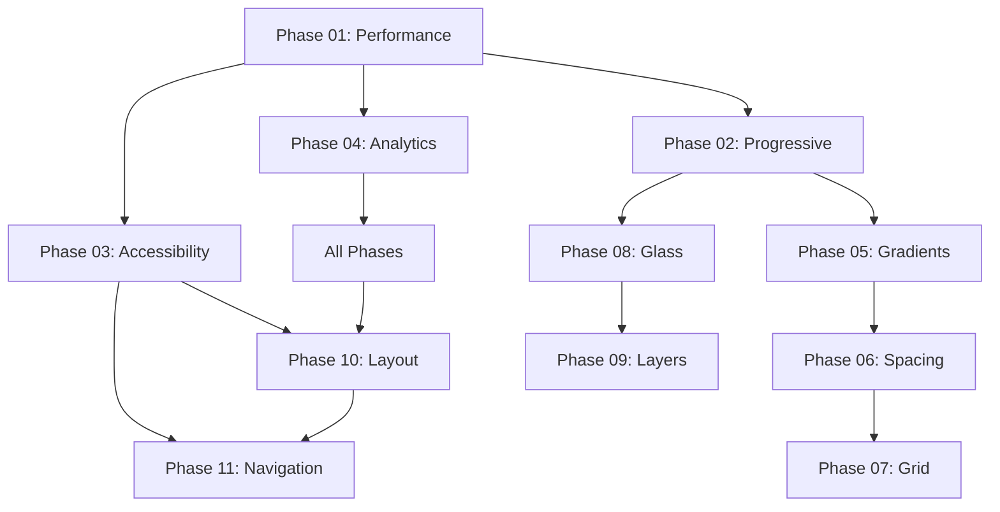

# Phase Integration Tracker - Code Continuity Management

## 🎯 Purpose
This document maintains awareness of how each phase builds upon previous work, ensuring code integration, preventing conflicts, and maintaining context across the 11-phase implementation.

## 📝 Git Commit Standards
All phase implementations MUST follow the structured commit format established in Phase 01.
See UI_IMPROVEMENT_PLAN.md section "Code Management & Git Policy" for detailed requirements.
**Branch transition occurs after Phase 04 completion:**
- Phases 1-4: `feature/marketing-redesign-foundation`
- Phases 5-11: `feature/marketing-visual-enhancement`

## 📊 Implementation Status

### **Phase 01: Performance & SEO Foundation**
- **Status:** ✅ COMPLETED
- **Files to Modify:**
  - `web/app/layout.tsx` (lines 16+) - Add Analytics/SpeedInsights
  - `web/app/page.tsx` (metadata section) - Enhanced SEO meta tags
  - `web/lib/performance.ts` - NEW FILE - Core Web Vitals tracking
- **Dependencies Created:** Performance monitoring foundation for all future phases
- **Next Phase Needs:** All visual phases must respect performance budgets

### **Phase 02: Progressive Enhancement Strategy**
- **Status:** ✅ COMPLETED
- **Files to Modify:**
  - `web/hooks/useFeatureDetection.ts` - NEW FILE - Browser capability detection
  - `web/hooks/useNetworkAware.ts` - NEW FILE - Connection-based loading
  - `web/components/ui/progressive-card.tsx` - NEW FILE - Enhanced card component
- **Dependencies Created:**
  - `useFeatureDetection()` hook for all glass effects
  - `useNetworkAware()` hook for image loading
  - Progressive component architecture
- **Next Phase Needs:** All visual components must use progressive enhancement

### **Phase 03: Accessibility Compliance**
- **Status:** ✅ COMPLETED
- **Files to Modify:**
  - `web/components/layout/navigation.tsx` (complete restructure) - ARIA labels, skip links
  - `web/app/globals.css` (lines 200+) - High contrast, reduced motion CSS
  - `web/app/page.tsx` (semantic structure) - Proper heading hierarchy
- **Dependencies Created:**
  - Accessibility-first component patterns
  - ARIA label standards
  - Keyboard navigation requirements
- **Next Phase Needs:** All components must maintain a11y compliance

### **Phase 04: Marketing Analytics Integration**
- **Status:** ✅ COMPLETED
- **Files Modified:**
  - `web/lib/analytics.ts` - NEW FILE - MVP analytics class with error handling
  - `web/hooks/useTracking.ts` - NEW FILE - Dynamic page tracking hook
  - `web/components/marketing/hero-section.tsx` - NEW FILE - Analytics-enabled hero component
  - `web/app/layout.tsx` (lines 56-81) - Added cookie consent banner with PostHog integration
  - `web/app/page.tsx` (lines 24-25) - Replaced hero with tracking component
  - `web/lib/performance.ts` (lines 20-25) - Integrated PostHog performance tracking
- **New Components Created:**
  - `MVPAnalytics` class - PostHog wrapper with 4 core events + performance tracking
  - `useTracking()` hook - Simple tracking interface for marketing components
  - `HeroSection` component - Client component with CTA tracking
- **Integration Points Established:**
  - Hook: `useTracking(pageName)` - Available for all marketing components
  - Analytics: `analytics.trackCTA()`, `analytics.trackSignupStart()` etc.
  - Performance: Core Web Vitals now sent to PostHog (consent-aware)
- **Dependencies for Next Phase:**
  - Analytics foundation ready for gradient engagement tracking
  - Cookie consent infrastructure in place
  - PostHog available for all future interactive elements
- **Testing Status:** TypeScript compilation ✅, Dev server ✅, Build has unrelated issues

---

## 🔗 **Visual Phase Integration Plan**

### **Phase 05: Gradient Headings**
- **Status:** 🟡 PENDING
- **Depends On:** Phases 01, 02, 03, 04
- **Files to Modify:**
  - `web/app/globals.css` (extend existing gradients ~lines 27-28) - Add missing gradient variants
  - `web/components/marketing/hero-section.tsx` (line 21) - Apply `.gradient` class to existing `hero-title`
  - `web/app/page.tsx` (line 35) - Apply gradient classes to features section heading
- **Integration Requirements:**
  - **Phase 01:** Ensure gradients don't impact performance scores
  - **Phase 02:** Use existing feature detection (browser fallbacks already implemented)
  - **Phase 03:** Maintain contrast ratios, high contrast mode fallbacks (already exists)
  - **Phase 04:** Track gradient text engagement with existing analytics
- **Existing Infrastructure Used:**
  ```css
  /* Already exists - will be extended */
  --gradient-text-hero: linear-gradient(135deg, var(--berkeley-blue) 0%, var(--xanthous) 100%);
  --gradient-text-primary: linear-gradient(135deg, var(--berkeley-blue) 0%, #2A4A70 100%);

  .hero-title.gradient { /* Already exists - just needs application */ }
  ```

### **Phase 06: Spatial Design**
- **Status:** 🟡 PENDING
- **Depends On:** Phase 05 (gradients established)
- **Files to Modify:**
  - `web/app/globals.css` (lines 44-55 expansion) - Enhanced spacing system
  - All component files - Container usage updates
- **Integration Requirements:**
  - **Phase 05:** Work with gradient headings spacing
  - **Phase 03:** Maintain accessibility spacing (44px touch targets)
  - **Phase 04:** Track section engagement with new spatial layout

### **Phase 07: Feature Grid**
- **Status:** 🟡 PENDING
- **Depends On:** Phase 05 (gradients), Phase 06 (spacing)
- **Files to Modify:**
  - `web/app/page.tsx` (lines 60-144) - Expand to 4x2 grid
- **Integration Requirements:**
  - **Phase 05:** Apply gradient text to feature titles
  - **Phase 06:** Use enhanced spacing system
  - **Phase 02:** Use progressive grid components
  - **Phase 03:** Maintain semantic structure
  - **Phase 04:** Track individual feature engagement

### **Phase 08: Gleam Effects**
- **Status:** 🟡 PENDING
- **Depends On:** Phases 5, 6, 7 (visual foundation established)
- **Files to Modify:**
  - `web/app/globals.css` (lines 165-200) - Glass morphism CSS
  - Feature cards - Apply glass effects
- **Integration Requirements:**
  - **Phase 01:** Monitor performance impact of backdrop-filter
  - **Phase 02:** CRITICAL - Use `useFeatureDetection()` for browser support
  - **Phase 03:** Ensure glass effects don't break contrast
  - **Phase 04:** Track glass effect engagement

### **Phase 09: Opacity Layers**
- **Status:** 🟡 PENDING
- **Depends On:** Phase 08 (glass effects use layering)
- **Files to Modify:**
  - `web/app/globals.css` - Complete z-index system overhaul
  - All positioned components - Z-index migration
- **Integration Requirements:**
  - **Phase 08:** Glass effects must work with new layer system
  - **Phase 03:** Layer system must not break focus order

### **Phase 10: Single-Page Layout**
- **Status:** 🟡 PENDING
- **Depends On:** All visual phases (5, 6, 7, 8, 9)
- **Files to Modify:**
  - `web/app/page.tsx` (major restructure) - Authentication routing, sections
  - `web/components/layout/navigation.tsx` - Anchor link integration
- **Integration Requirements:**
  - **Phase 01:** SEO must be preserved during single-page conversion
  - **Phase 03:** Accessibility navigation maintained
  - **Phase 04:** Track conversion funnel through sections

### **Phase 11: Navigation Rewrite**
- **Status:** 🟡 PENDING (HIGHEST RISK)
- **Depends On:** Phase 10 (routing established)
- **Files to Modify:**
  - `web/components/layout/navigation.tsx` (COMPLETE REWRITE)
- **Integration Requirements:**
  - **ALL PREVIOUS PHASES** - Must maintain all established patterns
  - **Phase 03:** CRITICAL - Preserve all accessibility features
  - **Phase 04:** Maintain analytics tracking

---

## 🚨 **Critical Integration Points**

### **Cross-Phase Dependencies**


### **Shared Code Elements**
- **`useFeatureDetection()` (Phase 02)** - Used by Phases 05, 08, 09
- **Analytics tracking (Phase 04)** - Integrated into ALL phases
- **Accessibility patterns (Phase 03)** - Required for Phases 10, 11, 07
- **Performance monitoring (Phase 01)** - Validates Phases 08, 09

---

## 📋 **Context Maintenance Protocol**

### **Before Starting Each Phase:**
1. **Review Integration Requirements** from this document
2. **Check Previous Phase Outputs** - What files were modified?
3. **Identify Code Dependencies** - What hooks/components to use?
4. **Plan Integration Points** - How does this connect to existing code?

### **During Phase Implementation:**
1. **Reference Previous Code** - Use established patterns
2. **Maintain Interfaces** - Don't break existing hooks/components
3. **Integrate Analytics** - Add tracking to all interactive elements
4. **Test Integration** - Verify previous phase compatibility

### **After Phase Completion:**
1. **Update This Document** - Mark phase complete, document changes
2. **Create Integration Tests** - Verify cross-phase compatibility
3. **Document New Dependencies** - What does next phase need?
4. **Git Commit with Context** - Detailed commit message with integration notes

---

## 🔄 **Status Update Template**

When completing each phase, update with:

```markdown
### **Phase X: [Name] - ✅ COMPLETE**
- **Files Modified:**
  - `path/to/file.tsx` (lines X-Y) - [what changed]
  - `path/to/file.css` (lines X-Y) - [what changed]
- **New Components Created:**
  - `ComponentName.tsx` - [purpose, interface]
- **Integration Points Established:**
  - Hook: `useHookName()` - [used by which future phases]
  - CSS: `.class-name` - [used where]
- **Dependencies for Next Phase:**
  - [What Phase X+1 expects to exist]
- **Testing Status:** [passed/failed with details]
```

---

**This document should be updated after EVERY phase completion to maintain context continuity.**