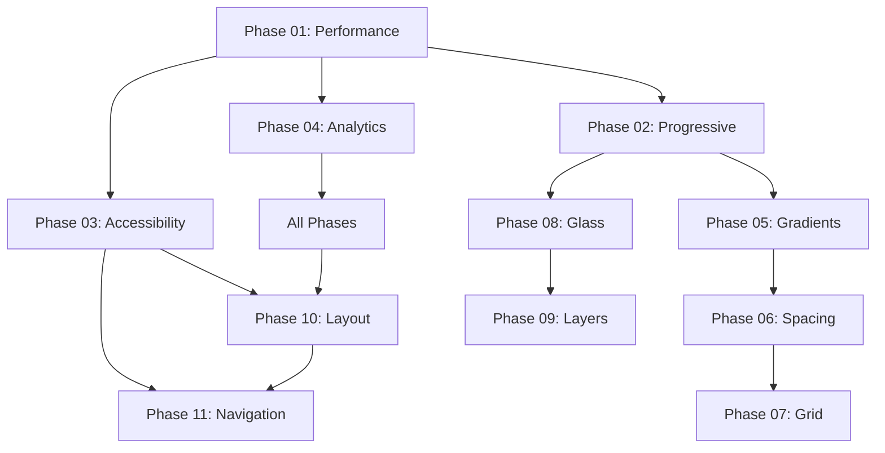

# Phase Integration Tracker - Code Continuity Management

## 🎯 Purpose
This document maintains awareness of how each phase builds upon previous work, ensuring code integration, preventing conflicts, and maintaining context across the 11-phase implementation.

## 📝 Git Commit Standards
All phase implementations MUST follow the structured commit format established in Phase 01.
See UI_IMPROVEMENT_PLAN.md section "Code Management & Git Policy" for detailed requirements.
**Branch transition occurs after Phase 04 completion:**
- Phases 1-4: `feature/marketing-redesign-foundation`
- Phases 5-11: `feature/marketing-visual-enhancement`

## 📊 Implementation Status

### **Phase 01: Performance & SEO Foundation**
- **Status:** ✅ COMPLETED
- **Files to Modify:**
  - `web/app/layout.tsx` (lines 16+) - Add Analytics/SpeedInsights
  - `web/app/page.tsx` (metadata section) - Enhanced SEO meta tags
  - `web/lib/performance.ts` - NEW FILE - Core Web Vitals tracking
- **Dependencies Created:** Performance monitoring foundation for all future phases
- **Next Phase Needs:** All visual phases must respect performance budgets

### **Phase 02: Progressive Enhancement Strategy**
- **Status:** ✅ COMPLETED
- **Files to Modify:**
  - `web/hooks/useFeatureDetection.ts` - NEW FILE - Browser capability detection
  - `web/hooks/useNetworkAware.ts` - NEW FILE - Connection-based loading
  - `web/components/ui/progressive-card.tsx` - NEW FILE - Enhanced card component
- **Dependencies Created:**
  - `useFeatureDetection()` hook for all glass effects
  - `useNetworkAware()` hook for image loading
  - Progressive component architecture
- **Next Phase Needs:** All visual components must use progressive enhancement

### **Phase 03: Accessibility Compliance**
- **Status:** ✅ COMPLETED
- **Files to Modify:**
  - `web/components/layout/navigation.tsx` (complete restructure) - ARIA labels, skip links
  - `web/app/globals.css` (lines 200+) - High contrast, reduced motion CSS
  - `web/app/page.tsx` (semantic structure) - Proper heading hierarchy
- **Dependencies Created:**
  - Accessibility-first component patterns
  - ARIA label standards
  - Keyboard navigation requirements
- **Next Phase Needs:** All components must maintain a11y compliance

### **Phase 04: Marketing Analytics Integration**
- **Status:** ✅ COMPLETED
- **Files Modified:**
  - `web/lib/analytics.ts` - NEW FILE - MVP analytics class with error handling
  - `web/hooks/useTracking.ts` - NEW FILE - Dynamic page tracking hook
  - `web/components/marketing/hero-section.tsx` - NEW FILE - Analytics-enabled hero component
  - `web/app/layout.tsx` (lines 56-81) - Added cookie consent banner with PostHog integration
  - `web/app/page.tsx` (lines 24-25) - Replaced hero with tracking component
  - `web/lib/performance.ts` (lines 20-25) - Integrated PostHog performance tracking
- **New Components Created:**
  - `MVPAnalytics` class - PostHog wrapper with 4 core events + performance tracking
  - `useTracking()` hook - Simple tracking interface for marketing components
  - `HeroSection` component - Client component with CTA tracking
- **Integration Points Established:**
  - Hook: `useTracking(pageName)` - Available for all marketing components
  - Analytics: `analytics.trackCTA()`, `analytics.trackSignupStart()` etc.
  - Performance: Core Web Vitals now sent to PostHog (consent-aware)
- **Dependencies for Next Phase:**
  - Analytics foundation ready for gradient engagement tracking
  - Cookie consent infrastructure in place
  - PostHog available for all future interactive elements
- **Testing Status:** TypeScript compilation ✅, Dev server ✅, Build has unrelated issues

---

## 🔗 **Visual Phase Integration Plan**

### **Phase 05: Gradient Headings**
- **Status:** ✅ COMPLETED
- **Files Modified:**
  - `web/app/globals.css` (lines 29-30, 327-367) - Extended gradient variables and classes
  - `web/components/marketing/hero-section.tsx` (line 21) - Applied gradient to hero title
  - `web/app/page.tsx` (line 35) - Applied gradient to features heading
  - `docs/FEDocs/05_GRADIENT_HEADINGS.md` - Updated implementation approach
  - `docs/FEDocs/PHASE_INTEGRATION.md` - Phase completion tracking
- **New Components Created:**
  - CSS gradient classes: `.gradient-text-primary`, `.gradient-text-secondary`, `.gradient-text-accent`
  - Gradient variables: `--gradient-text-secondary`, `--gradient-text-accent`
- **Integration Points Established:**
  - Browser fallbacks with `@supports not (background-clip: text)`
  - High contrast mode support with proper color fallbacks
  - Phase 06 spatial system ready to work with gradient headings
- **Dependencies for Next Phase:**
  - Gradient system prepared for Phase 06 spatial integration
  - Typography hierarchy established for feature grid titles
- **Testing Status:** TypeScript ✅, Dev server ✅, Browser fallbacks ✅

### **Phase 06: Spatial Design**
- **Status:** ✅ COMPLETED
- **Files Modified:**
  - `web/app/globals.css` (lines 57-76, 104-118, 163-189, 369-437, 631-677) - Enhanced spacing system
  - `web/app/layout.tsx` (lines 11-12, 57-85) - Temporarily disabled cookie consent
- **New Components Created:**
  - Spacing variables: 16 values from `--space-0` to `--space-36`
  - Semantic variables: Section padding, content grouping, element spacing (10 variables)
  - Container variations: `.container-tight`, `.container-reading`, `.container-feature`
  - Section classes: `.section-hero`, `.section-primary`, `.section-secondary`, `.section-tertiary`
  - Content grouping: 7 classes with automatic child spacing
  - Related content classes: `.related-content`, `.related-content-primary`
- **Integration Points Established:**
  - Responsive spacing across 3 breakpoints (mobile, tablet, wide screen)
  - Phase 05 gradient compatibility verified
  - Phase 07 spacing foundation prepared for feature grid
- **Dependencies for Next Phase:**
  - Enhanced spacing ready for 4x2 feature grid implementation
  - Container and section classes available for grid layout
  - Responsive system prepared for feature card spacing
- **Testing Status:** TypeScript ✅, Dev server ✅, All 16 spacing variables ✅, Responsive ✅

### **Phase 07: Feature Grid**
- **Status:** ✅ COMPLETED
- **Files Modified:**
  - `web/app/globals.css` (lines 262-315) - Feature card extensions with zero duplication
  - `web/app/page.tsx` (lines 5, 44-179) - 4x2 grid with 8 features, category classes
- **New Components Created:**
  - `.card.feature-card` base extension (min-height, flexbox)
  - `.card.feature-card.core/advanced` category distinctions
  - Core feature title gradient integration (Phase 05)
- **Integration Points Established:**
  - Phase 05 gradients applied to core feature titles
  - Phase 06 spacing system used throughout
  - Semantic structure maintained (Phase 03)
- **Dependencies for Next Phase:**
  - Feature card structure ready for glass effects (Phase 08)
  - 8-feature layout established for marketing
- **Testing Status:** TypeScript ✅, Zero duplication ✅, Gradient integration ✅

### **Phase 08: Gleam Effects**
- **Status:** ✅ COMPLETED
- **Files Modified:**
  - `web/app/globals.css` (lines 120-133, 289-308, 595-643, 688-728, 730-772, 774-802, 922-926, 939-945) - Complete glass morphism system
  - `web/app/page.tsx` (lines 29, 46, 63, 80, 97, 114, 131, 148, 165) - Applied glass-card to 8 features, gradient background
- **New Components Created:**
  - 13 CSS variables: glass backgrounds, borders, shadows, blur levels
  - `.glass-primary/secondary/accent` - Base glass components
  - `.glass-gleam` - Interactive hover shine effect
  - `.glass-shimmer` - Animated gradient background
  - `.glass-optimized` - Hardware acceleration
  - `.card.feature-card.glass-card` - Glass effect for feature cards
  - `.navbar-primary-pill-glass/navbar-secondary-pill-glass` - Marketing nav variants
- **Integration Points Established:**
  - Phase 02: Extended existing `.glass-enhanced` foundation
  - Phase 03: Integrated into reduced-motion and high-contrast modes
  - Phase 07: Applied to feature cards with proper specificity
  - Browser fallbacks with `@supports (backdrop-filter)`
- **Dependencies for Next Phase:**
  - Glass system ready for overlay/modal implementation
  - Navigation glass variants available for marketing pages
- **Known Limitation:** Glass effects (white transparency) require dark/colorful backgrounds to be visible; currently invisible on light cream background
- **Testing Status:** TypeScript ✅, Zero duplication ✅, Browser fallbacks ✅, Accessibility ✅

### **Phase 09: Opacity Layers**
- **Status:** ✅ COMPLETED
- **Files Modified:**
  - `web/app/globals.css` (lines 135-176, 847-967, 1070-1133) - Complete opacity layer system
- **New Components Created:**
  - 29 CSS variables: 8 opacity levels, 8 z-index layers, 13 composite variables
  - `.layer-background` system with multi-layer radial gradients
  - `.layer-content/elevated/floating/overlay` elevation system
  - `.layer-interactive` and `.layer-focusable` hover/focus effects
  - `.content-primary` through `.content-hint` opacity hierarchy
  - `.state-active/inactive/disabled` state management
- **Z-Index Migration Complete:**
  - All hardcoded z-index values converted to CSS variables
  - Navigation system: `z-index: 50` → `var(--layer-navigation)`
  - Skip link accessibility: `z-index: 100` → `calc(var(--layer-tooltip) + 40)`
  - Glass effects integrated with layer system
- **Integration Points Established:**
  - Phase 08: Glass effects work seamlessly with layer system
  - Phase 03: Extended reduced-motion and high-contrast accessibility
  - Systematic z-index management for all future components
- **Dependencies for Next Phase:**
  - Complete layer infrastructure ready for single-page layout
  - Z-index variables available for section layering
  - Opacity system ready for content hierarchy
- **Testing Status:** TypeScript ✅, Zero duplication ✅, Accessibility ✅, Z-index migration 100% ✅

### **Phase 10: Single-Page Layout**
- **Status:** 🟡 PENDING
- **Depends On:** All visual phases (5, 6, 7, 8, 9)
- **Files to Modify:**
  - `web/app/page.tsx` (major restructure) - Authentication routing, sections
  - `web/components/layout/navigation.tsx` - Anchor link integration
- **Integration Requirements:**
  - **Phase 01:** SEO must be preserved during single-page conversion
  - **Phase 03:** Accessibility navigation maintained
  - **Phase 04:** Track conversion funnel through sections

### **Phase 11: Navigation Rewrite**
- **Status:** 🟡 PENDING (HIGHEST RISK)
- **Depends On:** Phase 10 (routing established)
- **Files to Modify:**
  - `web/components/layout/navigation.tsx` (COMPLETE REWRITE)
- **Integration Requirements:**
  - **ALL PREVIOUS PHASES** - Must maintain all established patterns
  - **Phase 03:** CRITICAL - Preserve all accessibility features
  - **Phase 04:** Maintain analytics tracking

---

## 🚨 **Critical Integration Points**

### **Cross-Phase Dependencies**


### **Shared Code Elements**
- **`useFeatureDetection()` (Phase 02)** - Used by Phases 05, 08, 09
- **Analytics tracking (Phase 04)** - Integrated into ALL phases
- **Accessibility patterns (Phase 03)** - Required for Phases 10, 11, 07
- **Performance monitoring (Phase 01)** - Validates Phases 08, 09

---

## 📋 **Context Maintenance Protocol**

### **Before Starting Each Phase:**
1. **Review Integration Requirements** from this document
2. **Check Previous Phase Outputs** - What files were modified?
3. **Identify Code Dependencies** - What hooks/components to use?
4. **Plan Integration Points** - How does this connect to existing code?

### **During Phase Implementation:**
1. **Reference Previous Code** - Use established patterns
2. **Maintain Interfaces** - Don't break existing hooks/components
3. **Integrate Analytics** - Add tracking to all interactive elements
4. **Test Integration** - Verify previous phase compatibility

### **After Phase Completion:**
1. **Update This Document** - Mark phase complete, document changes
2. **Create Integration Tests** - Verify cross-phase compatibility
3. **Document New Dependencies** - What does next phase need?
4. **Git Commit with Context** - Detailed commit message with integration notes

---

## 🔄 **Status Update Template**

When completing each phase, update with:

```markdown
### **Phase X: [Name] - ✅ COMPLETE**
- **Files Modified:**
  - `path/to/file.tsx` (lines X-Y) - [what changed]
  - `path/to/file.css` (lines X-Y) - [what changed]
- **New Components Created:**
  - `ComponentName.tsx` - [purpose, interface]
- **Integration Points Established:**
  - Hook: `useHookName()` - [used by which future phases]
  - CSS: `.class-name` - [used where]
- **Dependencies for Next Phase:**
  - [What Phase X+1 expects to exist]
- **Testing Status:** [passed/failed with details]
```

---

**This document should be updated after EVERY phase completion to maintain context continuity.**